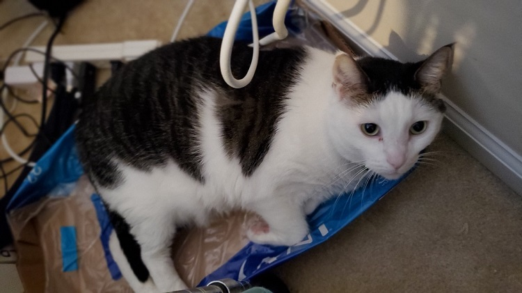
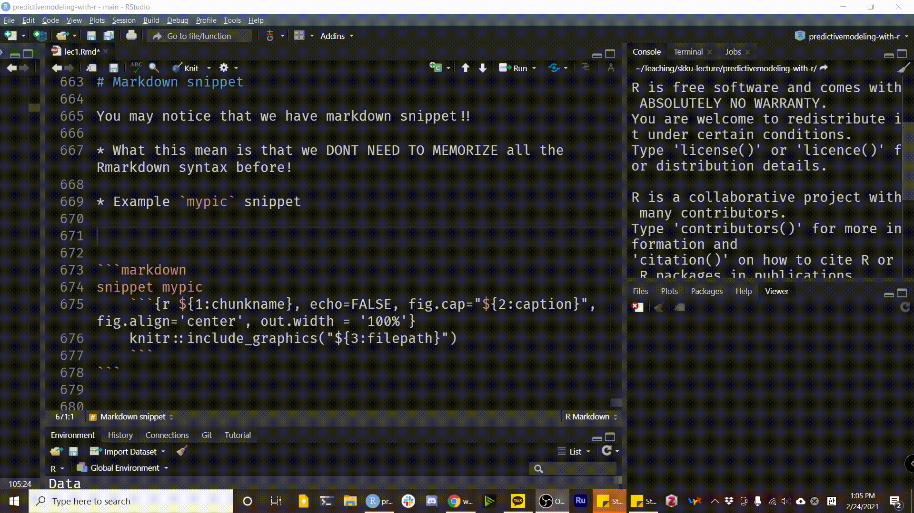
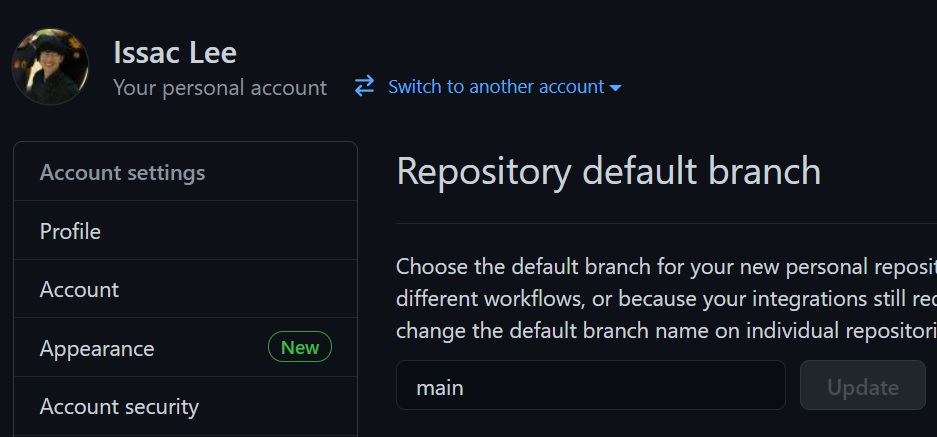

```{r setup, include=FALSE}
options(htmltools.dir.version = FALSE)
```

```{r xaringan-themer, include=FALSE, warning=FALSE}
library(tidyverse)
library(reticulate)
library(xaringanthemer)
style_duo_accent(
  text_font_size = "1.3rem",
  footnote_font_size = "0.6em",
  footnote_position_bottom = "20px",
  primary_color = "#7dad47",
  secondary_color = "#01467f",
  inverse_header_color = "#FFFFFF",
  code_font_google   = google_font("Fira Mono")
)
```

class: center, middle

# Sungkyunkwan University


## Actuarial Science

---
class: center, middle


# Predictive modeling with R

---
class: inverse, center, middle

# Instructor

---

# Issac Lee


* The University Of Iowa, Statistics & Actuarial Science

* SungKyunKwan University, Actuarial Science

* Website: [theissaclee.com](https://www.theissaclee.com/)

---

# Research Interests

* Pay-How-You-Drive insurance telematics data
* Replacing nested monte carlo simulation in insurance product valuation process
* Machine learning in Actuarial Science
* Graph theory & Spatial Statistics

---

# My family Another Me


---
# Companions

.pull-left[
## Jelly

]
.pull-right[
## Soony

]

---
class: inverse, center, middle
```{r ice-break, echo=FALSE, out.width = '15%', fig.ncol=2, fig.align='center'}
knitr::include_graphics("./hammer.svg")
knitr::include_graphics("./ice-cube.svg")
```


# Tell me about you

---

class: inverse, center, middle

# Lecture Intro.

---

.pull-left[
# Basic Info.

* Friday 9 am. - 12 am.

* Zoom will be provided

* Two 10 min. breaks

]
.pull-right[
# Our goal

* Find your **RESEARCH TOPIC**

* Explore many ML methodology

* Solid background about **Models**

* Solid background about **R**

  * Modeling and Visualization

  * Documentation

* How to collaborate with other people (Team codebook)

]

---
# Course Info.

* E-mail: sak-lee@uiowa.edu

* Please use **[SKKU:5155]** in your email subject

* Textbook
  
  - An Intro. to Statistical Learning

* Reference: 

  - Applied Predictive modeling
  - Feature Engineering and selection

---

# Course Topics

### Setup

* Github, Kaggle, R markdown

### R programming

* `tidyverse`, `tidymodels`, `torch`

### Statistical Models

* Regression, Classification, Tree-Based method, Deep-learning

---

# Course Activities

- Identify 3 candidate papers of different topics from the paper list. One will be assigned for presentation.

* Literature Review
  - Submit a 1500-words summary of the assigned paper
  
* Paper presentation
  - Present the paper in one of the classes. (20 min.) 
  - Prepare questions to ask the presenters you are assigned to review, and submit your comments

---

# Course Activities 2

* Form groups of three and sign up your group by next week

* Homework - 20%

* Indivisual Presentation - 30%

* Literature review (LR) – 20%

  - Propose topic and provide a list of at least 5 papers, more preferred.
  - Submit final LR document

* Course project (CP) (30%)
  * Proposal document & mid-term presentation, final presentation & report

---

# Course Activities 3

* **Apply** methods learned in the course to solve an important problem. 

* **Evaluate and compare** the performance of state-of-the-art methods on a problem

* Methodological innovation is not required, but encouraged.

Each group **MUST** have at least one meeting with me during office hours to discuss LR & CP topic.

---
class: inverse, middle, center

```{r question, echo=FALSE, fig.cap="", fig.align='center', out.width = '30%'}
knitr::include_graphics("./question.svg")
```
# Questions?

.footnote[Icons made by Freepik from flaticon.com]

---
<iframe width="1300" height="600" src="https://www.youtube.com/embed/s3JldKoA0zw?version=3&rel=0" frameborder="0" allow="accelerometer; encrypted-media; gyroscope; picture-in-picture" allowfullscreen></iframe>
---

# Set up **RStudio** Cloud 

* Sign up for a free RStudio Cloud account at https://rstudio.cloud/ 

* Recommend logging in with an existing Google or GitHub account

* I want you to be able to work from your own laptop in this workshop, but Cloud is **an important back-up plan** should you run into troubles.

---

# R markdown
.pull-left[

* R + Markdown

* We know R part

* How about Markdown part?

* [Markdown 10-minute interactive tutorial](https://commonmark.org/help/tutorial/)

  Pandoc takes care of markdown part. Pandoc is a universal document converter, which is written in [Haskell](https://www.haskell.org/).

]
.pull-right[


]

---
# The Knitting process

When we knitr the Rmd document, R generates md file, and it will be passed to pandoc!


* Possible outcomes: PDF(LaTex), HTML, Word file, epub file.. 

* [Gallery](https://rmarkdown.rstudio.com/gallery.html)


---
# Anatomy of an Rmd file

````markdown
---
title: "Here is the title"
date: 2021-02-23
output: html_document
---

`r ''````{r setup, include=FALSE}
library(tidyverse)
```

# Normal Distribution

Actually, Normal distribution is not normal, it's so special in Stat.

`r ''````{r}
x <- rnorm(100)
y <- rnorm(100)
plot(x, y)
```

````

---
# YAML header ("YAML Ain't Markup Language")

````markdown
*---
*title: "Here is the title"
*date: 2021-02-23
*output: html_document
*---

`r ''````{r setup, include=FALSE}
library(tidyverse)
```

# Normal Distribution

Actually, Normal distribution is not normal, it's so special in Stat.

`r ''````{r}
x <- rnorm(100)
y <- rnorm(100)
plot(x, y)
```

````

---

# Body (Plain Text part)

````markdown
---
title: "Here is the title"
date: 2021-02-23
output: html_document
---

`r ''````{r setup, include=FALSE}
library(tidyverse)
```

*# Normal Distribution
*
*Actually, Normal distribution is not normal, it's so special in Stat.

`r ''````{r}
x <- rnorm(100)
y <- rnorm(100)
plot(x, y)
```

````

---

# Code ("Not only R code")

````markdown
---
title: "Here is the title"
date: 2021-02-23
output: html_document
---

*`r ''````{r setup, include=FALSE}
*library(tidyverse)
*```

# Normal Distribution

Actually, Normal distribution is not normal, it's so special in Stat.

*`r ''````{r}
*x <- rnorm(100)
*y <- rnorm(100)
*plot(x, y)
*```

````

---
class: inverse, middle, center

# Basic Syntax

---

class: syntax-slide

.pull-left[
  ### This...
  \*italics\* and \*\*bold\*\*  
  
  <span>&#96;</span> inline code&#96;
  
  sub~2~/superscript^2^
  
  \~\~strikethrough\~\~
  
  escaped: \\* \\_ \\\
  
  endash: --, emdash: ---
  
  \> blockquote
  
  \# Header 1
  
]

.pull-right[
  ### turns into this...
  *italics* and **bold**
  
  `inline code`
  
  sub<sub>2</sub>/superscript<sup>2</sup>
  
  ~~strikethrough~~
  
  escaped: \* \_ \\
  
  endash: &ndash;, emdash: &mdash;
  
  > blockquote
  
  # Header 1

]

---
class: syntax-slide 
.pull-left[
  ### This...
  
  \- unordered list <br>
  &nbsp; &nbsp; \- sub-item <br>
  &nbsp; &nbsp; &nbsp; \- sub-sub-item
  
  1\. ordered list <br>
  1\. item 2 <br>
  &nbsp; &nbsp; \- sub-item 1 <br>

  inline-math: &#36;A = \pi*r^{2}&#36;
  
  math-block: <span>&#36;</span>&#36;A = \pi*r^{2}&#36;&#36;
  
]
.pull-right[
  ### turns into this...
  
  - unordered list
    - sub-item
      - sub-sub-item
  
  1. ordered list
  1. item 2 <br>
    i. sub-item 1 <br>

  inline-math: $A = \pi*r^{2}$
  
  math-block: $$A = \pi*r^{2}$$
  
]

---
class: inverse, middle, center

```{r code, echo=FALSE, fig.cap="", fig.align='center', out.width = '30%'}
knitr::include_graphics("./code.svg")
```

# Code

.footnote[Icons made by Freepik from flaticon.com]

---
class: small-font
# Code chunks


---

# Some chunk options

- `echo`: whether or not to display code in knitted output
- `eval`: whether or to to run the code in the chunk when knitting
- `include`: whether to include anything from the from a code chunk in the output document

---
# Setup chunk

````markdown
`r ''````{r setup, include=FALSE}
# don't show code unless we explicitly set echo = TRUE
knitr::opts_chunk$set(echo = FALSE)
```
````

- Normally, an R Markdown document starts with a chunk that's used to set some options and load required libraries.

- `knitr::opts_chunk$set` sets default options for all chunks.


---
# Including images

.pull-left[

````markdown
`r ''````{r chunkname, 
            fig.cap="picture caption",
            fig.align="center",
            out.width="50%"}
knitr::include_graphics("markdown.png")
```
````
]

.pull-right[

```{r echo=FALSE, out.width="50%", fig.align='center', fig.cap="picture caption"}
knitr::include_graphics("./question.svg")
```

]

---
# Inserting plot

.pull-left[

````markdown
`r ''````{r}
cars %>% 
  ggplot() +
    aes(x = speed, y = dist) +
    geom_point()
```
````

]

.pull-right[
```{r, out.width="60%", fig.align='center', fig.retina = 3}
cars %>% 
  ggplot() +
    aes(x = speed, y = dist) +
    geom_point()
```

]

---
# Tables

.pull-left[
````markdown
`r ''````{r}
knitr::kable(head(as.tibble(mtcars[,1:3]), 5), 
             position = "!h",
             col.names = c("col1", "col2", "col3"),
             caption = "caption", 
             align = "lrc", booktab = TRUE)
```
````
]

.pull-right[
```{r echo=FALSE}
# cars is a built-in-to-R data set of cars
knitr::kable(head(as.tibble(mtcars[,1:3]), 5), 
             position = "!h",
             col.names = c("col1", "col2", "col3"),
             caption = "caption", 
             align = "lrc", booktab = TRUE)
```

]


---
# Inline code

Inside your text you can include code with the syntax <span>&#96;</span>&nbsp; r code here&#96; &nbsp;.

For example, <span>&#96;</span>&nbsp; r 4 + 4&#96; &nbsp; would output `r 4 + 4` in your text. 

```{r, echo = TRUE}
dim(diamonds)
num_diamonds <- nrow(diamonds)
```

.pull-left[
There are <span>&#96;</span>&nbsp; r num_diamonds&#96;  &nbsp; rows in the `diamonds` dataset.
]

.pull-right[
There are `r num_diamonds` rows in the `diamonds` dataset.
]

---
class: larger-body
# Inline code with python

At the moment, syntax like <span>&#96;</span>&nbsp; python code here&#96; &nbsp; is not valid. However, you can use the [`reticulate`](https://rstudio.github.io/reticulate/articles/r_markdown.html) package to access variables from python chunks.

````markdown
`r ''````{python}
my_number = 4 + 8
```
````

```{python echo=FALSE}
my_number = 4 + 8
```

````markdown
`r ''````{r}
library(reticulate)
py$my_number
```
````

```{r}
py$my_number
```

`my_number` can be referred inline by <span>&#96;</span>&nbsp; r py$my_number&#96;&nbsp;.

---
class: center, middle, inverse

# Useful tips

---
# Very Important

`Alt` + `Shift` + `K` shows all shortcuts! However, some are USEFUL, some are **NOT**!

### Useful **Shortcuts!**

.pull-left[

add `%>%` operator: `Ctrl` + `Shift` + `m`

add `<-` operator: `Alt` + -

add cursors! : `Ctrl` + `Alt` + down or up

search functions: `Ctrl` + .

search commands: `Ctrl` + `Shift` + `p`

]
.pull-right[

Run current chunk: `Ctrl` + `Alt` + `c`

R code re-formatting: `Ctrl` + `Shift` + `a`

Copy current below: `Shift` + `Alt` + down

Insert `R` code chunk: `Ctrl` + `Alt` + i

]

---
# Very Very Important

Modify and Make your own shortcuts!

`Tools` > `Modify Keyboard Shortcuts` will open another door to you.

For example,

* Insert `python` code: `Ctrl` + `Alt` + p

* Insert snippet: `Shift` + `Space`

---
# $Very^\infty$ Important

**Snippet** save your time, almost 1 year during your whole life, no joke.

.pull-left[
### What the hack is snippet
* **Text macros** that are used for quickly inserting common snippets of code

* `Tools` > `Global option` > `Code` > `Snippet`

* Some people know there are *code snippet* in Rstudio

]
.pull-right[

```{r snippet, echo=FALSE, fig.cap="Available snippets languages", fig.align='center', out.width = '80%'}
knitr::include_graphics("./snippet.jpg")
```

]

---
# Markdown snippet

You may notice that we have markdown snippet!! 

* You **DONT NEED TO MEMORIZE** all the Rmarkdown syntax!

.pull-left[

* Example `mypic` snippet

````markdown
snippet mypic
    `r ''````{r ${1:chunkname}, echo=FALSE, fig.cap="${2:caption}", fig.align='center', out.width = '100%'}
	  knitr::include_graphics("${3:filepath}")
	  ```
````

]
.pull-right[



]

---
# Snippet is in action


---
# **R**Markdown packages

.pull-left[

* **Pagedown**: single html document generation

* **Bookdown** - pdf, epub, or html book

  * Writing a gitbook like [Prof. Tierney](http://homepage.stat.uiowa.edu/~luke/classes/STAT7400-2021/_book/index.html)

* **Blogdown** - Static website builder Hugo wrapper

  * Personal website like [me](theissaclee.com)

  * Theme: Academy, Apero (is developing by Rstudio)

]
.pull-right[

* **Distill**: if you really like minimalizm.

  * Concept is developed by Google, package developed by Rstudio.
  * Suitible for academic writing

* **Xaringan**: Presentation

  *  Like the one you're looking at.

  * `xaringan themer` - Easy theming package 
  
* **Thesisdown**: Thesis with Rmd.

]

---
# Set up GitHub 

* Using GitHub in this lecture for **version control** and **publishing**.

* Sign up for a GitHub.com account at https://github.com/join

* Complete these installation instructions.

* Test your connection between GitHub and RStudio following these steps.

  * you choose HTTPS over SSH, and
  * you setup a GitHub Personal Access Token.

---
# Check out your default branch

* `main` as the default branch for all new repositories

* To check this, for user accounts, go to: https://github.com/settings/repositories

* You should see something like this:

```{r chunkname, echo=FALSE, fig.align='center', out.width = '50%'}

```

If yours still says master, you may change it to main here if you wish.

---
# Github Intergration

```{r eval=FALSE}
install.packages(c("usethis", "remotes"))
remotes::install_github("rstudio/rmarkdown")
```

```{r}
rmarkdown::pandoc_version()
```

### Set up your Github PAT(Personal Access Token)

To use `usethis` package, you need to set up PAT. Instruction is here:

https://happygitwithr.com/credential-caching.html#get-a-pat


---

# Publish your self in online

```{r, eval=FALSE}
install.packages("postcards")
```

* Restart your R session. 
* If you use RStudio, use the menu item Session > Restart R
  * Ctrl + Shift + F10 (Windows and Linux) or
  * Command + Shift + F10 (Mac OS).

```{r}
packageVersion("postcards")
```

---
# Create GitHub repo 

We’ll follow a “New Project, GitHub first” workflow.

* Go online to your GitHub account
* Create a new repository and YES initialize this repository by adding a README file.

```{r, eval=FALSE}
usethis::create_from_github("username/my-postcard", 
                            destdir = "/pathto/project")
```

in RStudio Cloud see this link:

https://bren.zendesk.com/hc/en-us/articles/360015826731-How-to-connect-RStudio-Cloud-with-Github

---
# Create your post-card

```{r, eval=FALSE}
library(postcards)
create_postcard()
```

Four Theme

* jolla (https://seankross.com/postcards-templates/jolla/)
* jolla-blue (https://seankross.com/postcards-templates/jolla-blue/)
* trestles (https://seankross.com/postcards-templates/trestles/)
* onofre (https://seankross.com/postcards-templates/onofre/)

---
# Knit postcard

* Edit your postcard

* Publish a postcard

```{r, eval=FALSE}
usethis::use_github_pages(branch = "main", path = "/")
```

---
# Make your portfolio website with distill

* Distill is a package built for R Markdown, 
* Aiming to creating computational documents in R.
* The goal of the Distill is to provide an output format optimized for online **scientific and technical** communication.
* Awesome template for your [portfolio site](https://ijeamaka-anyene.netlify.app/)

.pull-left[

```{r}
# install.packages("distill")
packageVersion("distill")
```

]
.pull-right[
```{r distill, echo=FALSE, fig.cap="", fig.align='center', out.width = '50%'}
knitr::include_graphics("https://iyo-rstudio-global.netlify.app/package/distill/featured-hex.png")
```

]

---
# How to

1. Create & Clone GitHub repo, then First commit & push

  * Test yourself, you can do it now.

1. Create a new distill site
```{r, eval=FALSE}
library(distill)
create_website(dir = ".", title = "iyo-distill", gh_pages = TRUE)
```

1. Build site 

* Close the RStudio IDE and re-open it. Look in your Git pane, you should see a .Rproj file has changed:

* Hit Build tab, and build your first website!

---
# Polish the main site

Use `postcard` package to polish the main site.

* `index.Rmd` file YMAL

```ymal
---
title: "your name"
image: "your picture.png"
links:
  - label: GitHub
    url: "https://github.com/your_id"
  - label: LinkedIn
    url: "https://www.linkedin.com/in/your_id/"
  - label: Email
    url: "mailto:youremail@gmail.com"
site: distill::distill_website
output:
  postcards::trestles
---
```

---
# Site navigation

`_site.yml` controls the site behavior

```ymal
---
output: distill::distill_article
output_dir: "docs"
---
```

* Commit & Publish site

```{r, eval=FALSE}
usethis::use_github_pages(branch = "main", path = "/docs")
```

---
# Add portfolio page

```{r, eval=FALSE}
distill::create_post("first-writing")
```

* Creates a directory called `_posts/` to hold all your future blog posts.

* Creates a new post with a “slug” including the date and the name of the post (here, mine was "welcome").

---
# Add listing page

.pull-left[

### Create Portfolio tab

* Add a blank .Rmd file to your project root, e.g. `portfolio.Rmd`

* Add following YAML

```yaml
---
title: "Portfolio"  # any name you want here
listing: posts # do this exactly
---
```

]
.pull-right[
### Add a link to the main page

* Edit `_site.yml` file & Check the result

```yaml
---
navbar:
  right:
    - text: "Home"
      href: index.html
    - text: "Portfolio"      # add
      href: portfolio.html   # add
    - icon: fab fa-github    # try
      href: https://github.com/your-id 
    - icon: fab fa-linkedin-in #try  
      href: https://www.linkedin.com/in/your-account/ 
---
```
]

---
# Add categories

* To get the category page, add the following `yaml`

```yaml
---
collections:
  posts:
    categories: true
    categories_metadata: true
    authors_metadata: true
---
```

* Look at your YAML file, which should be look like [this](https://github.com/statisticsplaybook/kaggle-playbook/blob/main/_site.yml) 

---
# Theme

* You can edit your theme

  https://rstudio.github.io/distill/website.html#theming

* For changing Korean font

  * See the following repo:
  
  https://github.com/statisticsplaybook/kaggle-playbook
  
  * In Action
  
  https://statisticsplaybook.github.io/kaggle-playbook/
  

---
# Authoring 


  
---
class: center, middle

# Thanks!

Slides Contents is built above 

Wonderful Rmd workshop by [Ulrik Lyngs](https://github.com/ulyngs/rmarkdown-workshop-2019)

Wonderful IYO workshop by [Allison Hill](https://iyo-rstudio-global.netlify.app/)
