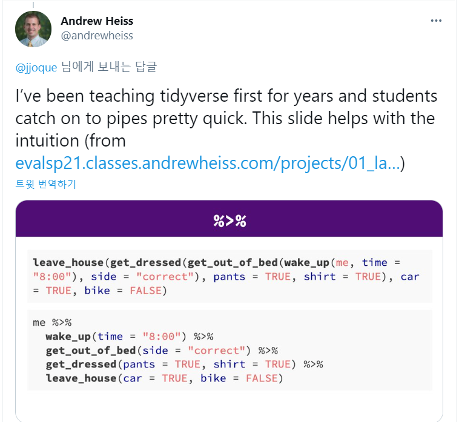

```{r setup, include=FALSE}
options(htmltools.dir.version = FALSE)
```

```{r xaringan-themer, include=FALSE, warning=FALSE}
library(tidyverse)
library(reticulate)
library(xaringanthemer)
style_duo_accent(
  text_font_size = "1.3rem",
  footnote_font_size = "0.6em",
  footnote_position_bottom = "20px",
  primary_color = "#7dad47",
  secondary_color = "#01467f",
  inverse_header_color = "#FFFFFF",
  code_font_google   = google_font("Fira Mono")
)
```

class: center, middle

# Sungkyunkwan University


## Actuarial Science

---
class: center, middle


# Part 1: Get started


---

---
class: center, middle


# What is `tidyverse` ?

---
# `tidyverse` is a collection of R packages

* "official" tidyverse initiated from 2016

* Most of the components have a much longer history:

  * `ggplot2` is 13 years old.
  
## Objective: 

  * Help new learners to get started with doing data science in `R`.
  
---
# Core packages

.pull-left[

```{r, eval=FALSE}
library(tidyverse)
```

* `ggplot2`: data visualisation
* `dplyr`: data wrangling
* `readr`: reading data
* `tibble`: modern data frames
* `stringr`: string manipulation
* `forcats`: dealing with factors
* `tidyr`: data tidying
* `purrr`: functional programming

]
.pull-right[

]

---
# Tidy dataset

`Tidy datasets` are easy to manipulate, model and visualize, and have a specific structure:

* Each variable is a column
* Each observation is a row
* Each type of observational unit is a table

.pull-left[

| treatment | a |  b|
|---|------------|------------|
|John Smith |  | 2 |
|Jane Doe | 16 | 11 |
|Mary Johnson | 3 | 1 |

]
.pull-right[

|person | treatment | result |
|------|------------|--------|
|John Smith | a | — |
|Jane Doe | a | 16 |
|Mary Johnson | a | 3 |
|John Smith | b | 2 |
|Jane Doe | b | 11 |
|Mary Johnson | b | 1 |


]
  
---
# `tidyverse` Get started

```{r}
library(tidyverse)
```

* Take a look at what it says!

* You need to **Read** message/warnings/errors. (Especially important when you have *error*.)

* Tell me your interpretation

* What does `::` mean?

---
# Example data set: `palmerpenguins`

```{r}
# devtools::install_github("allisonhorst/palmerpenguins")
library(palmerpenguins)
```

* The goal of palmerpenguins is to provide a great dataset for data exploration & visualization, as an alternative to `iris`.

```{r penguinespic, echo=FALSE, fig.cap="palmerpenguins", fig.align='center', out.width = '50%'}
knitr::include_graphics("https://allisonhorst.github.io/palmerpenguins/reference/figures/lter_penguins.png")
```

---
# Hands-on: use your **R** skills

* How many variables? How many penguins? for each type? 

* Maximum values of `bill_length_mm` for each type?

* Any plots?

```{r}
head(penguins)
```

---
# Bill dimensions

.pull-left[

* bill length measures in `mm`

* flipper == penguin's wing

]
.pull-right[

```{r billpic, echo=FALSE, fig.cap="bill lenght information", fig.align='center', out.width = '100%'}
knitr::include_graphics("https://allisonhorst.github.io/palmerpenguins/reference/figures/culmen_depth.png")
```

]

---
# Explore the data

Let's take a big picture here.

```{r}
glimpse(penguins)
```

---
class: center, middle

# The `pipe` operator; `%>%`

```{r pipepic, echo=FALSE, fig.cap="Ceci n'est pas un pipe", fig.align='center', out.width = '60%'}
knitr::include_graphics("https://revolution-computing.typepad.com/.a/6a010534b1db25970b01a3fd380b67970b-800wi")
```

---
# `%>%` operator

* `tidyverse` operator

* pass the result to the next function as the first input.

```{r}
sum(1:10)

1:10 %>% sum()
```
---
# Use it to make your code readable

[{width="70%"}](https://twitter.com/andrewheiss/status/1359583543509348356)

---
class: center, middle

# 5 important verbes in `dplyr`

`filter()`, `arrange()`, `select()`, `mutate()`, `summarise()`

---
class: center, middle

# `filter()`

---
# `filter()` data

* filtering data with condition.

```{r}
penguins %>% 
  filter(species == "Chinstrap")
```

---
# `filter()` data option

* two conditions

```{r}
penguins %>% 
  filter(species == "Chinstrap", island == "Dream")
```

---
# `filter()` data option

* how about `or` condition?

```{r}
penguins %>% 
  filter(species %in% c("Chinstrap", "Adelie"))
```

---
# logical operator in `R`

1. `&` : and
1. `|` : or
1. `!` : not
1. `>`, `<`, `<=`, `>=` : relationship

* How to write the following using the above logical operator?

```{r eval=FALSE}
penguins %>% 
  filter(species %in% c("Chinstrap", "Adelie"), island == "Dream")
```

---
# Your turn

* How many penguins we have which they are either `Adelie` or `Gentoo`, and their bill length is between 30 and 100?

--

```{r}
penguins %>% 
  filter(species %in% c("Adelie", "Gentoo"),
         (bill_length_mm > 30 & bill_length_mm < 100)) %>% 
  nrow()
```

---
class: center, middle

# `select()`

---
# `select()` data

.pull-left[
* `select()` columns from data

```{r}
penguins %>% 
  select(species, bill_length_mm, bill_depth_mm) %>% 
  head()
```

]
.pull-right[
* deselect `species` column from data

```{r}
penguins %>% 
  select(-species) %>% 
  head()
```

]


---
# `select()` multiple columns

```{r}
penguins %>% 
  select(bill_length_mm:body_mass_g)
```

---
# `select()` with condition

* select variables with the same ending

```{r}
penguins %>% 
  select(ends_with("mm")) %>% 
  names()
```


---
# `select()` with `everything()`

* rearrange columns with `everything()`

```{r}
penguins %>% 
  select(island, bill_length_mm, everything()) %>% 
  head()
```

---
class: center, middle

# `mutate()`

---
# Make columns with `mutate()`

* Make `bill_total` as the sum of the two columns.

```{r}
penguins %>% 
  select(species, bill_length_mm, bill_depth_mm) %>% 
  mutate(bill_total = bill_length_mm + bill_depth_mm) %>% 
  head()
```

---
# Make columns with `mutate()`

* You can use the mutated column to make another columns.

```{r}
penguins %>% 
  select(species, bill_length_mm, bill_depth_mm) %>% 
  mutate(bill_total = bill_length_mm + bill_depth_mm,
         bill_average = bill_total/2) %>% 
  head()
```

---
# Make columns with `transmute()`

* When you want to get a seperate dataframe from the mutation,

```{r}
penguins %>% 
  select(species, bill_length_mm, bill_depth_mm) %>% 
  transmute(bill_total = bill_length_mm + bill_depth_mm,
         bill_average = bill_total/2) %>% 
  head()
```

---
class: center, middle

# `arrange()`

---
# `arrange()` data

arrange based on `bill_length_mm`

```{r}
penguins %>% 
  select(species, bill_length_mm, bill_depth_mm) %>% 
  mutate(bill_length_mm = ceiling(bill_length_mm),
         bill_depth_mm = ceiling(bill_depth_mm)) %>% 
  arrange(bill_length_mm)
```

---
# `arrange()` data

add another reference column `bill_depth_mm`

```{r}
penguins %>% 
  select(species, bill_length_mm, bill_depth_mm) %>% 
  mutate(bill_length_mm = ceiling(bill_length_mm),
         bill_depth_mm = ceiling(bill_depth_mm)) %>% 
  arrange(bill_length_mm, bill_depth_mm)
```

---
# `arrange()` data

Sort `bill_depth_mm` column in descending order.

```{r}
penguins %>% 
  select(species, bill_length_mm, bill_depth_mm) %>% 
  mutate(bill_length_mm = ceiling(bill_length_mm),
         bill_depth_mm = ceiling(bill_depth_mm)) %>% 
  arrange(bill_length_mm, desc(bill_depth_mm))
```

---
class: center, middle

# `summarize()`

---
# Smart summary with `summarize()`

```{r}
penguins %>% 
  summarize(bill_length_mean = mean(bill_length_mm,  na.rm = TRUE),
            bill_depth_mean = mean(bill_depth_mm, na.rm = TRUE))
```

---
# `summarize()` with `group_by()`

```{r}
penguins %>% 
  group_by(species) %>% 
  summarize(bill_length_mean = mean(bill_length_mm,  na.rm = TRUE),
            bill_depth_mean = mean(bill_depth_mm, na.rm = TRUE))
```

---
class: center, middle

# `across()`

---
# `across()`

Apply a function **across** to columns. Useful with `summarise()` and `mutate()`. 

* Previously, we use the `summarize()` to get the summary.

```{r message=FALSE, warning=FALSE}
penguins %>% 
  group_by(species) %>% 
  summarize(
    bill_length_mean = mean(bill_length_mm,  na.rm = TRUE),
    bill_depth_mean = mean(bill_depth_mm, na.rm = TRUE),
    flipper_length_mm = mean(bill_depth_mm, na.rm = TRUE)
  )
```

---
# `across()`

Apply the same function across to the columns as follows:

```{r message=FALSE, warning=FALSE}
penguins %>% 
  group_by(species) %>% 
  summarize(across(bill_length_mm:flipper_length_mm, mean, na.rm = TRUE))
```

---
# `across()`

`across()` works well with other functions in `dplyr`. For example,

```{r message=FALSE, warning=FALSE}
penguins %>% 
  group_by(species) %>% 
  summarize(across(bill_length_mm:flipper_length_mm, mean, na.rm = TRUE))
```

---
class: center, middle

# What's beyond?


---
class: center, middle

# Grammar of Graphics `ggplot2`


---
# The Grammar of Graphics

* Understand quantitative plots as we intuitively understand grammar in language.

> The *quick brown* **fox** `jumps over` the *lazy* **dog**.

* Sentences are elegant compositions of carefully-chosen grammatical elements that convey precise and clear messages.


---
## Grammar of Graphics - Essentials


.pull-left[

```{r data-base, message=FALSE, warning=FALSE}
library(ggplot2)
p <- ggplot(data = penguins)
p
```

]

.pull-right[

**Data**

The source of information for your visualization.

`ggplot()` requires your data to be `data.frame` or `tibble`, also it should be 'tidy' data set.

* Every variable has a column
* Every observation has a row
]

---
# aesthetics

.pull-left[

```{r eval=FALSE}
p <- ggplot(data = penguins,
            aes(x = bill_length_mm,
                y = bill_depth_mm))
p   
```

* mapping variables in dataset to `x` and `y` components in the ggplot.

* There are many aesthetics;

  - x, y: x and y axes
  - alpha: degree of transparency
  - color, fill
  - shape, size
  - etc.
]
.pull-right[
```{r message=FALSE, warning=FALSE, echo=FALSE}
p <- ggplot(data = penguins,
            aes(x = bill_length_mm,
                y = bill_depth_mm))
p   
```

]


---
# geom layer

.pull-left[

```{r eval=FALSE}
p <- p + 
    geom_point(aes(color = as_factor(species), 
                   size = body_mass_g,
                   alpha = 0.7))
p
```

* scatter plot is consists of geometric points

]
.pull-right[
```{r message=FALSE, warning=FALSE, echo=FALSE}
p <- p + 
    geom_point(aes(color = as_factor(species), 
                   size = (body_mass_g/1000),
                   alpha = 0.7))
p   
```

]
---
# Combination: `aes()` + `geom()`

There are many combination you can make with these two;

.pull-left[

```{r eval=FALSE}
# Method 1 
ggplot(data = penguins,
       aes(x = body_mass_g, 
           y = bill_length_mm))

# Method 2
ggplot(data = penguins) +
  geom_point(aes(x = body_mass_g, 
           y = bill_length_mm))

# Method 3
ggplot() +
  geom_point(data = penguins,
         aes(x = body_mass_g, 
           y = bill_length_mm))
```

]
.pull-right[

* Method 1: Best when using one data set and one aesthetic mapping

* Method 2: Best when using one data set, and multiple geoms + aesthetic mappings

* Method 3: Best when using multiple data sets, and multiple geoms + aesthetic mappings

]

.footnote[p.15 of slide by [Ijeamakaanyene's intro-to-ggplot2](https://github.com/Ijeamakaanyene/intro-to-ggplot2)]

---
class: middle, center

# Play with it!

---
# scales

Finalize your aesthetic with the data property

.pull-left[

```{r eval=FALSE}
p + scale_y_continuous(
  "Bill depth (mm)",
  breaks = seq(0, 30, by = 1)
)
```

Syntax: `scale_<aes>_<type>()`

- Change Label, Breaks, Limits, etc.

- `scale_color_continuous()` related to change your color for continuous variables.


]
.pull-right[

```{r, echo=FALSE, message=FALSE, out.width="80%"}
p + scale_y_continuous(
  "Bill depth",
  breaks = seq(0, 30, by = 3),
  labels = paste(seq(0, 30, by = 3), "mm")
)
```

]
---
# color

You can set the colors using palette or manually.

.pull-left[

```{r eval=FALSE}
p <- p + 
    scale_color_brewer(palette = "Set1",
                       labels = c("myAdele", "myChinstrap", "myGentoo"))
p
```

* Available palette

`BrBG, PiYG, PRGn, PuOr, RdBu, RdGy, RdYlBu, RdYlGn, Spectral, Accent, Dark2, Paired, Pastel1, Pastel2, Set1, Set2, Set3`


]
.pull-right[

```{r echo=FALSE, warning=FALSE}
p <- p + 
    scale_color_brewer(palette = "Set1",
                       labels = c("myAdele", "myChinstrap", "myGentoo"))
p
```

]

---
# Confirm your setting

.pull-left[

```{r eval=FALSE}
p <- p + 
    scale_alpha_identity() +
    scale_size_identity()
p
```

* `alpha` was set at 0.7 but, it was not the actual 70% transparency.

* `size` is also identified with the function.

]
.pull-right[

```{r echo=FALSE, warning=FALSE}
p <- p + 
    scale_alpha_identity() +
    scale_size_identity()
p
```

]

---
# legend

.pull-left[

```{r eval=FALSE}
my_species <- guide_legend(title = "Species", ncol = 3)

p <- p + 
  guides(color = my_species) +
  theme(legend.position = "bottom")
p
```

]
.pull-right[

```{r echo=FALSE, warning=FALSE, out.width='80%'}
my_species <- guide_legend(title = "Species", ncol = 3, order = 1)

p <- p + 
  guides(color = my_species) +
  theme(legend.position = "bottom")
p
```


]


---
# facets

.pull-left[

```{r eval=FALSE}
p <- p + facet_wrap(vars(island))
p 
```

* facet makes multiple plots w.r.t. variables.

]
.pull-right[
```{r message=FALSE, warning=FALSE, echo=FALSE}
p <- p + facet_wrap(vars(island))
p
```

]

---
# Title, subtitle, and captions

.pull-left[

```{r eval=FALSE}
p <- p + labs(title = "Visualization of palmer penguins", 
     subtitle = "Bill length vs depth by species",
     x = "bill length", y = "bill depth",
     caption = "https://theissaclee.com")
p
```

]
.pull-right[

```{r echo=FALSE, warning=FALSE}
p <- p + labs(title = "Visualization of palmer penguins", 
     subtitle = "Bill length vs depth by species",
     x = "bill length", y = "bill depth",
     caption = "https://theissaclee.com")
p
```


]

---
# ggrepel package

.pull-left[

```{r eval=FALSE, warning=FALSE}
library(ggrepel)

mypoints <- penguins %>% 
  filter(bill_depth_mm > 20, bill_length_mm > 40)

p <- p + 
  geom_label_repel(
    data = mypoints,
    aes(x = bill_length_mm,
        y = bill_depth_mm,
        label = paste("(",bill_length_mm, ", ",bill_depth_mm,")")),
    color = "black",
    size = 2)
p
```

]
.pull-right[

```{r echo=FALSE, warning=FALSE}
library(ggrepel)

mypoints <- penguins %>% 
  filter(bill_depth_mm > 20, bill_length_mm > 40)

p <- p + 
  geom_label_repel(
    data = mypoints,
    aes(x = bill_length_mm,
        y = bill_depth_mm,
        label = paste("(",bill_length_mm, ", ",bill_depth_mm,")")),
    color = "black",
    size = 2)
p
```


]

---
# aspect ratio

.pull-left[
```{r eval=FALSE, out.width='60%', warning=FALSE}
tibble(x = 1:10, y = 2*x) %>% 
  ggplot(aes(x = x, y = y)) +
  geom_line() + coord_fixed()
```

]
.pull-right[
```{r echo=FALSE, out.width='90%', warning=FALSE}
tibble(x = 1:10, y = 2*x) %>% 
  ggplot(aes(x = x, y = y)) +
  geom_line() + coord_fixed()
```

]


---
# theme

`ggplot2` has a lot of [theme](https://ggplot2.tidyverse.org/reference/ggtheme.html). It has even a theme package.

.pull-left[

```{r eval = FALSE}
p + theme_bw()
```

* check out `ggthemr` package

]
.pull-right[

```{r echo=FALSE, warning=FALSE}
p + theme_bw()  +
  theme(legend.position = "bottom")
```

]

---
# Box plot

```{r boxplot1, echo=TRUE, warning=FALSE, fig.cap="One single boxplot", fig.align='center', out.width = '30%'}
ggplot(penguins, aes(y = body_mass_g)) +
  geom_boxplot()
```
---
# Box plot by species

```{r boxplot2, echo=TRUE, warning=FALSE, fig.cap="One single boxplot", fig.align='center', out.width = '30%'}
ggplot(penguins, aes(x = species, y = body_mass_g)) +
  geom_boxplot()
```

---
# Box plot by species

The plot is flipped. Why?

```{r boxplot3, echo=TRUE, warning=FALSE, fig.cap="", fig.align='center', out.width = '30%'}
ggplot(penguins, aes(x = body_mass_g, y = species)) +
  geom_boxplot()
```

---
# Box plot by species

Add actual values.

```{r boxplot4, echo=TRUE, warning=FALSE, fig.cap="", fig.align='center', out.width = '30%'}
ggplot(penguins, aes(x = species, y = body_mass_g)) +
  geom_boxplot(outlier.shape = NA) + geom_jitter(width = 0.2)
```

---
# Box plot with continuous variables

You can draw the boxplot using continuous variables

```{r boxplot5, echo=TRUE, warning=FALSE, fig.cap="", fig.align='center', out.width = '30%'}
ggplot(penguins, aes(x = bill_length_mm, y = body_mass_g)) + geom_boxplot()
```

---
# Box plot with continuous variables

You can draw the boxplot using continuous variables

```{r boxplot6, echo=TRUE, warning=FALSE, fig.cap="", fig.align='center', out.width = '30%'}
ggplot(penguins, aes(x = bill_length_mm, y = body_mass_g)) + 
  geom_boxplot(aes(group = cut_width(bill_length_mm, 5)))
```

---
# Bar chart

```{r barchart, echo=TRUE, warning=FALSE, fig.cap="Bar chart", fig.align='center', out.width = '30%'}
ggplot(penguins, aes(y = species)) +
  geom_bar()
```

---
# Bar chart with `fct_reorder`

```{r barchart2, echo=TRUE, warning=FALSE, fig.cap="Bar chart", fig.align='center', out.width = '30%'}
penguins %>% 
  count(species) %>% 
  ggplot(aes(x = n, y = fct_reorder(species, n))) +
  geom_col()
```

---
# Reference

* https://dplyr.tidyverse.org/

* https://ggplot2.tidyverse.org/

* https://ijeamaka-anyene.netlify.app/posts/2020-10-22-workshop-an-introduction-to-ggplot2/


---
class: center, middle, inverse

# Thanks!
